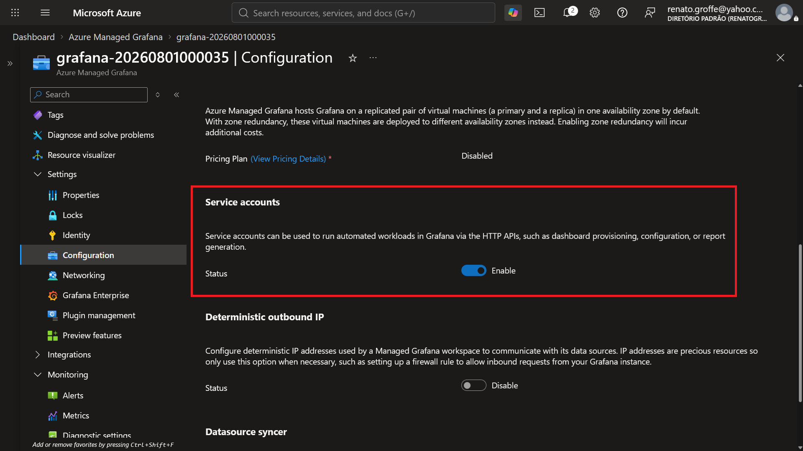
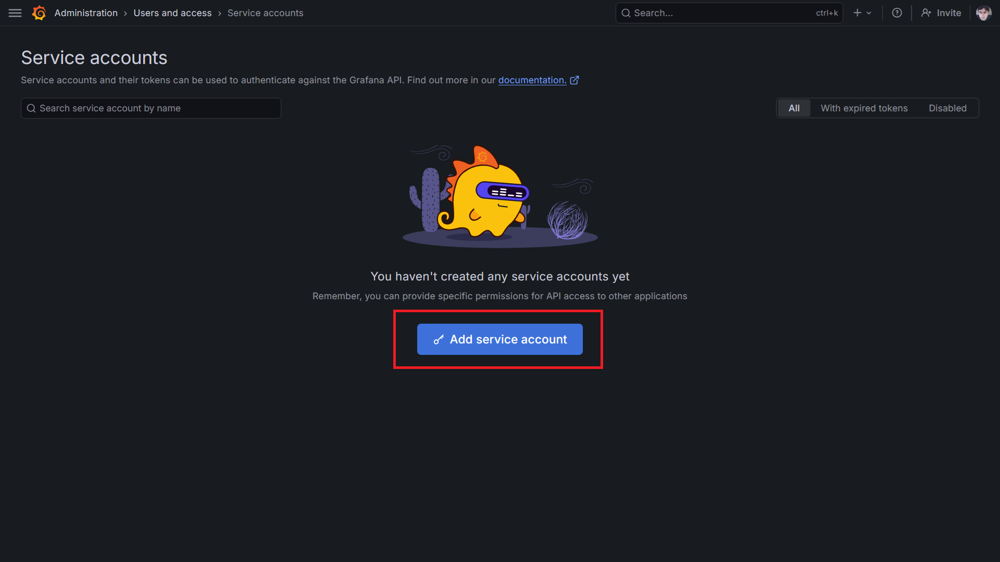
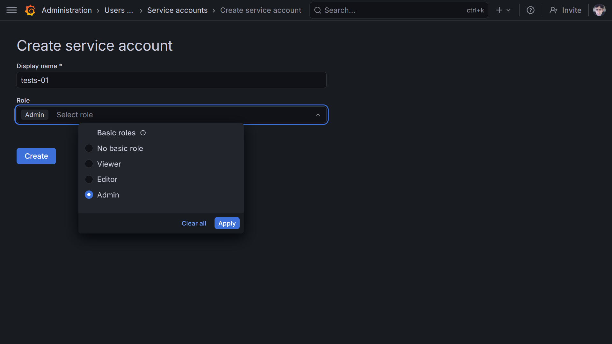
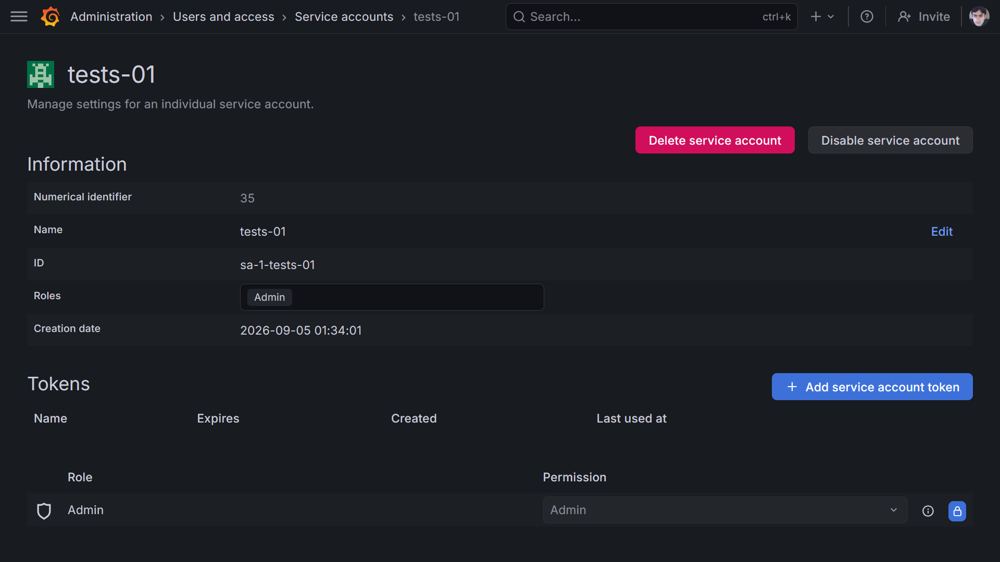
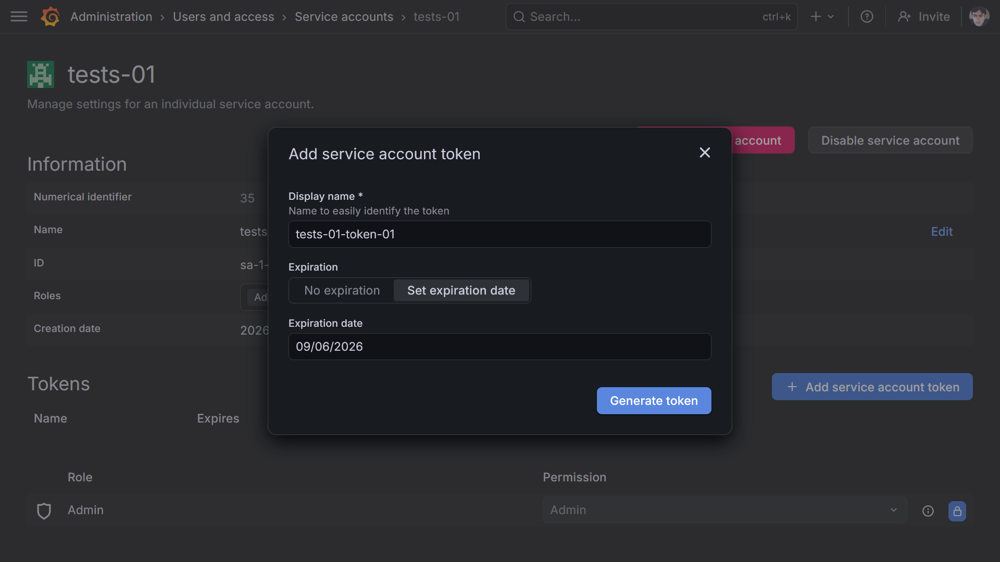
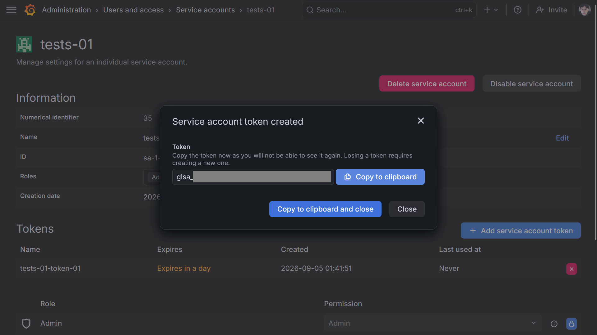
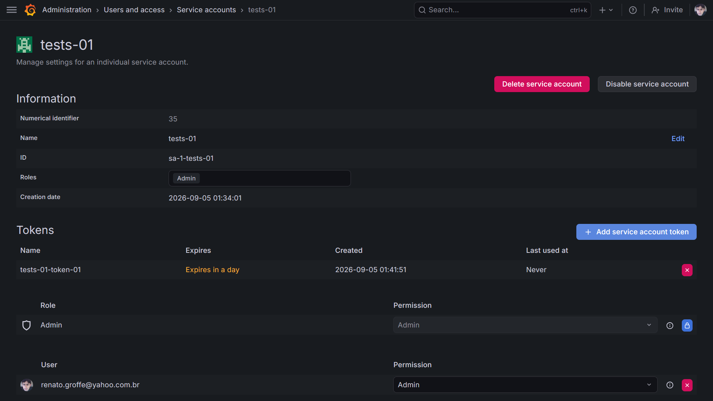
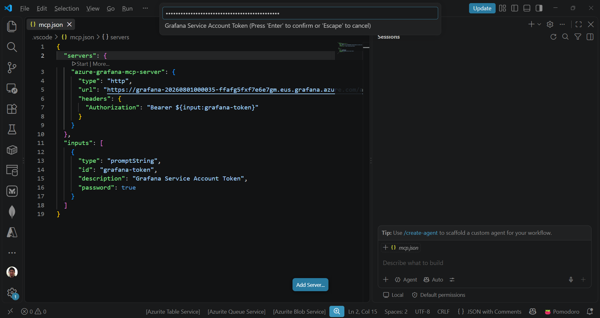
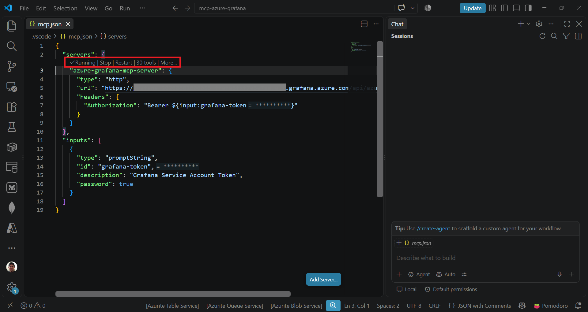

# azuremanagedgrafana-mcpserver-vscode-githubcopilot
Configurações para uso do MCP Server do Azure Managed Grafana + Visual Studio Code + GitHub Copilot. Testes realizados com métricas obtidas de um cluster Kubernetes baseado no AKS (Azure Kubernetes Service) e integrado com o Azure Managed Prometheus.

Habilitando o uso de Service Account na instância do Azure Managed Grafana no Portal do Azure (Settings > Configuration):



Criar dentro do Grafana uma nova Service Account (Administration > Users and access > Service accounts):



Criando a Service Account e atribuindo a role Admin:



Service Account criada com sucesso:



Ao clicar em "+ Add service account token" poderemos então configurar a validade do novo token:



E chegaremos a um novo token criado com sucesso:



Alguns detalhes desta nova Service Account:



Utilizar agora como base as seguintes definições no arquivo mcp.json do Visual Studio Code:

```json
{
  "servers": {
    "azure-grafana-mcp-server": {
      "type": "http",
      "url": "https://<grafana-endpoint>/api/azure-mcp",
      "headers": {
        "Authorization": "Bearer ${input:grafana-token}"
      }
    }
  },
	"inputs": [
		{
			"type": "promptString",
			"id": "grafana-token",
			"description": "Grafana Service Account Token",
			"password": true
		}
	]
}
```

Informando o token da Service Account do Grafana no VS Code:



Finalmente teremos o MCP Server com a autenticação realizada com sucesso:



